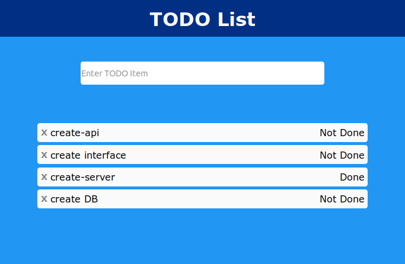

# TODO-Fullstack-App-Go-Gin-Postgres-React


This fullstack application creates a TODO List Web Page using the Go/Gin/Postgres/React Stack.



## Starting the application

In the project root, run: 
```
docker-compose build 
docker-compose up
```

## Go server

Go is used to spin up the server, define routing, and interact with the database.

## Gin router

Gin is used to define the TODO API with functionality such as:

1. Listing all TODO items.
2. Creating a new TODO item and adding to the database.
3. Updating a TODO item with its completed condition.
4. Deleting a TODO item from the database.
5. Later being able to filter TODO items.

## Postgres Database

Postgres is used to store the TODO items by saving rows in as id, item-text, and done boolean condition.

## React

React is used here to create the frontend fully responsive application on the client side and is built using components.
